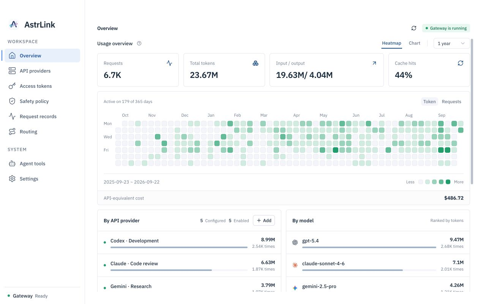
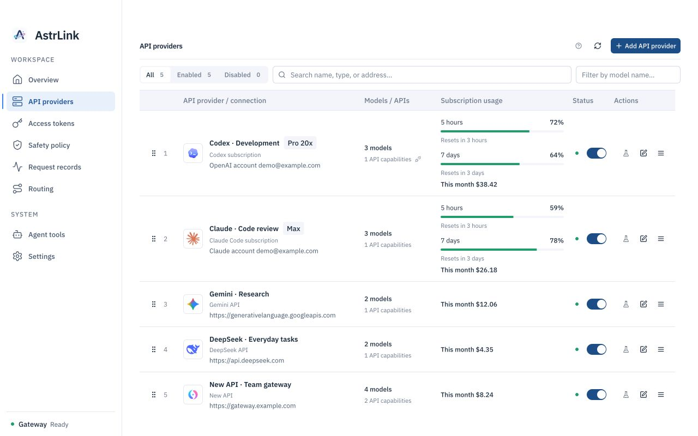
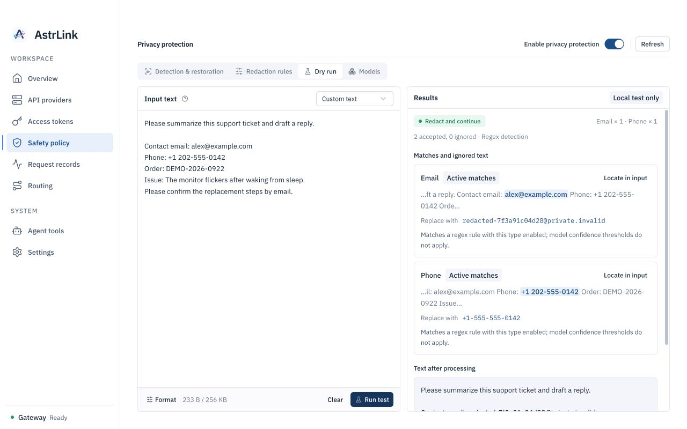
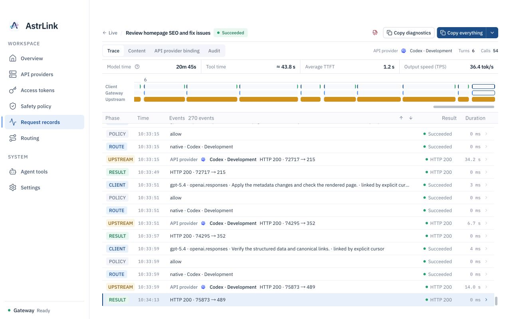

<!-- markdownlint-configure-file {
  "MD013": { "tables": false },
  "MD033": { "allowed_elements": ["p", "img"] },
  "MD041": false
} -->

  

# AstrLink

**English** | [简体中文](README.zh-CN.md)

**A local AI gateway for AI agents, unifying your subscriptions and API
providers with smart routing and on-device privacy protection.**

AstrLink is an open-source desktop app for macOS, Windows, and Linux. Connect
your existing subscriptions or API providers, point your agent to the local API
endpoint, and manage models, routing, privacy policies, and request records in
one place.

[Getting started](#getting-started) ·
[On-device privacy protection](#on-device-privacy-protection) ·
[User guides (Chinese)](docs/guides/README.md) ·
[Contributing (Chinese)](CONTRIBUTING.md)

## Screenshots

Simulated accounts, usage, costs, and request content. Click an image to view it
at full size.

| Overview                                                                                                                   | API providers                                                                                                                                                |
| -------------------------------------------------------------------------------------------------------------------------- | ------------------------------------------------------------------------------------------------------------------------------------------------------------ |
|                  |                                   |
| **On-device privacy protection**                                                                                           | **Request details**                                                                                                                                          |
|  |  |

## Features

- **On-device privacy protection**: Detect sensitive content with local rules or
  a local privacy model. Warn, block, or redact according to your policies, and
  optionally restore placeholders in responses.
- **Subscriptions and APIs in one place**: Connect Codex, Claude, and Grok
  subscriptions, major API providers, Coding Plans, and compatible gateways such
  as New API. Manage accounts and credentials centrally.
- **Smart routing**: Configure model aliases, provider priorities, and retries.
  Install a local classification model to let `astrlink/auto` select a target
  model automatically.
- **Multiple API protocols**: Expose OpenAI Responses, Chat Completions,
  Anthropic Messages, and Gemini endpoints, with protocol conversion
  configurable according to upstream capabilities.
- **Request records and usage tracking**: Inspect requests, session traces,
  upstream attempts, and errors. Track usage and estimated costs by provider,
  model, and access token.

## On-device privacy protection

With privacy policies enabled, AstrLink can detect sensitive content, redact
requests, and restore responses locally:

1. **Detect on your device**: Use built-in rules, custom rules, or a local
   privacy model to identify sensitive content such as secrets, email addresses,
   and phone numbers. Rule-based detection requires no model download.
2. **Apply your policies**: Choose to warn, block, or redact. Redaction replaces
   detected sensitive content with placeholders. Configure detection categories
   and allowlists, then check the results with a dry run.
3. **Restore responses when needed**: Enable response restoration to replace
   placeholders returned by the model with their original values, so your agent
   can continue using the results.

The gateway, privacy detection, and redaction run on your device. Inference
requests are still sent to the upstream API providers you configure. What gets
processed depends on your enabled policies and detection results. Request body
capture is off by default and can be enabled separately for troubleshooting.

Local privacy models must be downloaded or imported; see
[Privacy model settings (Chinese)](apps/desktop/README.md#隐私模型). For
thinking signatures and encrypted continuation data, see
[Privacy detection and continuation compatibility (Chinese)](docs/guides/privacy-reasoning-continuation.md).

## Installation

AstrLink is in early development, with no official installer release yet.
Published versions will be available on
[Releases](https://github.com/Calcium-Ion/AstrLink/releases).

You can run from source by following the
[development and build instructions (Chinese)](CONTRIBUTING.md). You can also
download build artifacts from successful
[Actions](https://github.com/Calcium-Ion/AstrLink/actions) runs while signed in
to GitHub. These are development builds and may not be signed or notarized.

| Platform | Packages and requirements                                                    |
| -------- | ---------------------------------------------------------------------------- |
| macOS    | Apple Silicon / Intel, macOS 13.4 or later                                   |
| Windows  | x64 `.exe` installer; WebView2 may need to be downloaded during installation |
| Linux    | x64 `.deb`, Debian 12 or a compatible newer distribution                     |

Privacy and routing classification models are downloaded or imported separately.
Model weights are not included in the app package.

## Getting started

### 1. Connect a subscription or API

Open AstrLink, make sure the gateway is running, then go to **API providers**
and add an existing subscription or API.

| Subscription or API                                                           | How to connect                                                                               |
| ----------------------------------------------------------------------------- | -------------------------------------------------------------------------------------------- |
| Codex, Claude, or Grok subscription                                           | Select the subscription type and follow the authorization steps; Grok uses device code login |
| New API or another compatible gateway                                         | Enter the gateway URL and its API key                                                        |
| OpenAI, Anthropic, Gemini, DeepSeek, Qwen, Kimi, GLM, MiniMax, Doubao, or xAI | Select the provider under pay-as-you-go APIs and enter your API key                          |
| OpenCode Go, Kimi Coding, GLM Coding Plan, or MiniMax Coding Plan             | Select the Coding Plan and use its subscription-specific credentials                         |

After saving, fetch or manually add the models you want to use. **Providers with
an empty model list will not handle inference requests.** API and Coding Plan
credentials and endpoints may differ; see the
[provider setup guide (Chinese)](docs/guides/pay-as-you-go-providers.md).

Model availability, quotas, and billing depend on the account or provider. Cost
estimates in AstrLink are for reference; your provider's bill is authoritative.

### 2. Create an access token

Go to **Access tokens** and create a token for your agent. Use this token when
connecting the agent to the local gateway. Configure upstream API keys under
**API providers**.

Give each agent its own token to track usage and revoke access independently.

### 3. Connect your AI agent

Copy the current API address from **Overview** or **Settings**. The default is
`http://127.0.0.1:8317`, but the port may change if it is already in use. Use
the address shown in the app.

Enter the local API address, access token, and model in your agent's model
configuration. For an OpenAI-compatible client using Chat Completions:

| Setting  | Value                                                                  |
| -------- | ---------------------------------------------------------------------- |
| Base URL | `http://127.0.0.1:8317/v1`, adjusted to the actual port                |
| API Key  | The AstrLink access token you just created                             |
| Model    | A model ID from the provider's model list, or a configured model alias |

Base URL requirements vary by client: some append `/v1` automatically, while
others expect a full endpoint URL. Common request paths are:

| API protocol            | Request path                             |
| ----------------------- | ---------------------------------------- |
| OpenAI Responses        | `/v1/responses`                          |
| OpenAI Chat Completions | `/v1/chat/completions`                   |
| Anthropic Messages      | `/v1/messages`                           |
| Gemini                  | `/v1beta/models/{model}:generateContent` |

The provider must support the client's API protocol, or you must configure an
available protocol conversion.

### 4. Configure routing and privacy policies

- In **Routing**, configure model aliases, target providers, and retries. Before
  using `astrlink/auto`, configure the classification model and routing targets.
- In **Safety policy**, choose the detection method and action. Check the
  results with a dry run before using the policy for everyday requests. Local
  models must be downloaded or imported first.
- In **Routing**, enable provider reuse within a session. Inspect bindings or
  provider reselection in request records; see
  [Provider stickiness and binding audits (Chinese)](docs/guides/provider-stickiness.md).

Once configured, send a request and check **Request records** to confirm the
provider, model, and result.

## FAQ

**Why does my client report an authentication error?**

Make sure you are using a valid AstrLink access token. If request records show
an upstream 401 or 403 response, check the provider's API key or subscription
login status.

**Why is a model missing, or why are no API providers available?**

Check that the provider is enabled, its model list includes the requested model,
and its enabled inbound protocols match the request. If you use a model alias,
also check its routing targets.

**Why can I no longer connect to the previous port?**

Check the current API address in the app. If the default port is in use,
AstrLink chooses an available one. Restart the gateway after changing the port
in settings.

**Why are requests rejected after enabling a privacy model?**

Check that the model is installed and the policy is configured correctly, then
inspect the error in request records. If the model is unavailable, requests are
rejected rather than forwarded without privacy detection.

**Will my client still work after I close the window?**

It depends on your window-close setting. Hiding to the tray keeps the gateway
running; quitting the app stops it. See
[Desktop settings (Chinese)](apps/desktop/README.md).

## Feedback and contributing

Report problems through
[Issues](https://github.com/Calcium-Ion/AstrLink/issues). Include your operating
system, app version, steps to reproduce, and redacted error details. Keep API
keys, access tokens, and private request bodies out of reports.

To contribute code or build from source, read the
[contributing guide (Chinese)](CONTRIBUTING.md).

## License

AstrLink's own source code is licensed under [Apache-2.0](LICENSE). Third-party
components retain their respective licenses and attributions.

Core uses [RelayKit](https://github.com/QuantumNous/new-api/tree/main/relaykit),
which is licensed under AGPL-3.0. Distributing builds that include it or
offering the corresponding functionality over a network also requires compliance
with that dependency's license terms.
