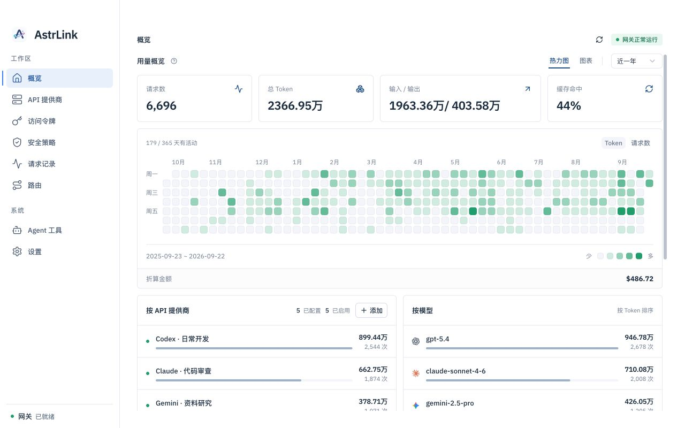
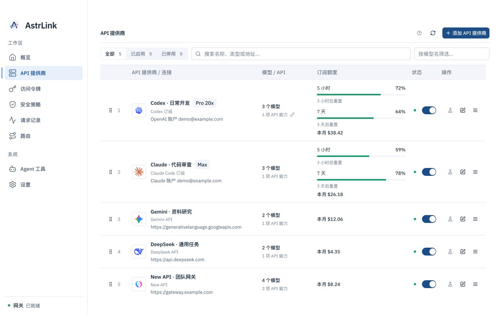
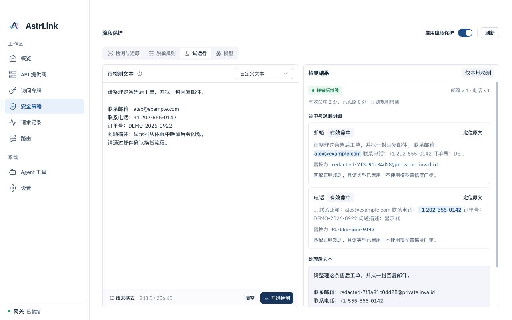
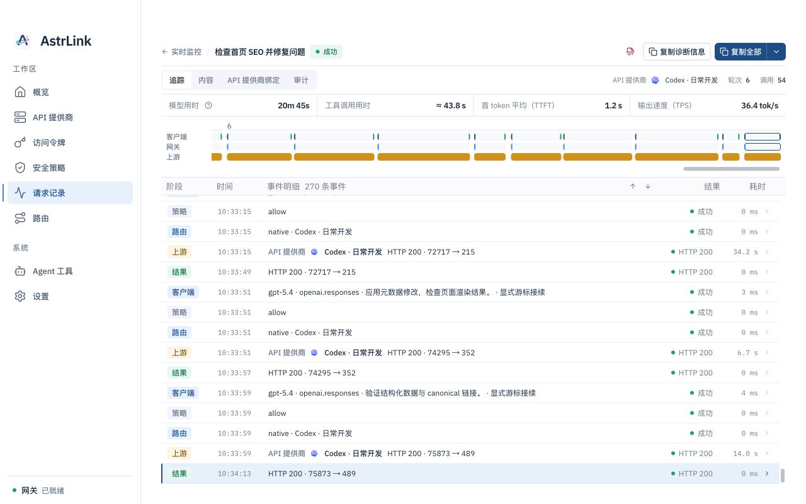

<!-- markdownlint-configure-file {
  "MD013": { "tables": false },
  "MD033": { "allowed_elements": ["p", "img"] },
  "MD041": false
} -->

  

# AstrLink

[English](README.md) | **简体中文**

**为 AI
Agent 打造的本地 AI 网关，统一接入 AI 订阅与 API，支持智能路由和本地隐私保护。**

AstrLink 是一款开源桌面应用，支持 macOS、Windows 和 Linux。连接已有的订阅或 API 提供商，再将 Agent 指向本机 API 地址，即可在一个界面中管理模型、路由、隐私策略和调用记录。

[开始使用](#开始使用) · [本地隐私保护](#本地隐私保护) ·
[使用指南](docs/guides/README.md) · [参与开发](CONTRIBUTING.md)

## 项目截图

账号、用量、费用和请求内容均为模拟数据。点击图片可查看原图。

| 概览                                                                                                          | API 提供商                                                                                                                         |
| ------------------------------------------------------------------------------------------------------------- | ---------------------------------------------------------------------------------------------------------------------------------- |
|          |                 |
| **本地隐私保护**                                                                                              | **请求详情**                                                                                                                       |
|  |  |

## 核心能力

- **本地隐私保护**：通过本地规则或本地隐私模型检测敏感内容，按策略提醒、拦截或脱敏，并支持响应中的占位符还原。
- **订阅与 API 统一接入**：连接 Codex、Claude、Grok 订阅、主流厂商 API、Coding
  Plan 和 New API 等兼容网关，集中管理账号与密钥。
- **智能路由**：配置模型别名、提供商优先级和失败重试；安装本地分类模型后，可通过
  `astrlink/auto` 自动选择目标模型。
- **多协议支持**：提供 OpenAI Responses、Chat Completions、Anthropic
  Messages 和 Gemini 接口，并可根据上游能力配置协议转换。
- **调用记录与用量统计**：查看请求、会话轨迹、上游尝试和错误原因，按提供商、模型和访问令牌统计用量及估算费用。

## 本地隐私保护

启用安全策略后，AstrLink 可以在本机完成敏感内容检测、请求脱敏和响应还原：

1. **在本机检测**：使用内置规则、自定义规则或本地隐私模型，识别密钥、邮箱、手机号等敏感内容。规则检测无需下载模型。
2. **按策略处理**：选择提醒、拦截或脱敏。脱敏会将检测到的敏感内容替换为占位符；可配置检测类型与白名单，先通过试运行检查效果。
3. **按需还原响应**：启用响应还原后，将模型返回的占位符恢复为原始内容，便于 Agent 继续使用结果。

网关、隐私检测和脱敏在本机运行；推理请求仍会发送到你配置的上游 API 提供商。实际处理取决于启用的策略与检测结果。请求正文捕获默认关闭，可在排查问题时单独开启。

本地隐私模型需要下载或导入，详见[隐私模型设置](apps/desktop/README.md#隐私模型)。涉及思考签名或加密续传数据时，参见[隐私检测与续传兼容说明](docs/guides/privacy-reasoning-continuation.md)。

## 安装

项目处于早期开发阶段，目前尚未发布正式安装包。已发布版本会放在
[Releases](https://github.com/Calcium-Ion/AstrLink/releases)。

现在可以从源码运行，步骤见 [开发与构建](CONTRIBUTING.md)。也可以在
[Actions](https://github.com/Calcium-Ion/AstrLink/actions)
中下载成功运行产生的构建产物（需要登录 GitHub）；这些属于开发构建，可能尚未签名或公证。

| 平台    | 安装包与要求                                         |
| ------- | ---------------------------------------------------- |
| macOS   | Apple Silicon / Intel，macOS 13.4 或更新版本         |
| Windows | x64 `.exe` 安装程序；安装过程中可能需要下载 WebView2 |
| Linux   | x64 `.deb`，Debian 12 或兼容的新版本发行版           |

隐私模型和路由分类模型按需下载或导入，安装包不包含模型权重。

## 开始使用

### 1. 接入订阅或 API

打开 AstrLink，确认网关已启动，然后进入 **API 提供商**，添加已有的订阅或 API。

| 已有的订阅或 API                                                         | 接入方式                                                             |
| ------------------------------------------------------------------------ | -------------------------------------------------------------------- |
| Codex、Claude、Grok 订阅                                                 | 选择对应订阅类型，按界面提示完成账号授权；Grok 使用 Device Code 登录 |
| New API 或其他兼容网关                                                   | 填写网关地址和对应的 API Key                                         |
| OpenAI、Anthropic、Gemini、DeepSeek、千问、Kimi、GLM、MiniMax、豆包、xAI | 在按量付费 API 中选择厂商，再填写开放平台密钥                        |
| OpenCode Go、Kimi Coding、GLM Coding Plan、MiniMax Coding Plan           | 选择对应 Coding Plan，使用订阅专用凭据                               |

保存后拉取或手动添加需要使用的模型。**模型列表为空的提供商不会处理推理请求。**
API 和 Coding Plan 的密钥、地址可能不同，详见
[API 提供商接入指南](docs/guides/pay-as-you-go-providers.md)。

模型可用性、额度和计费取决于对应账号或提供商。AstrLink 中的费用估算仅供参考，请以提供商账单为准。

### 2. 创建访问令牌

在 **访问令牌**
中为 Agent 创建一个令牌。Agent 连接本地网关时使用此令牌；上游 API Key 在
**API 提供商** 中配置。

为不同 Agent 分配独立令牌，便于查看用量和单独撤销访问。

### 3. 连接 AI Agent

从 AstrLink 的概览或设置中复制当前 API 地址。默认地址是
`http://127.0.0.1:8317`；端口被占用时可能变化，以界面显示为准。

在 Agent 的模型配置中填写本地 API 地址、访问令牌和模型。以使用 Chat
Completions 的 OpenAI 兼容客户端为例：

| 配置项   | 填写内容                                          |
| -------- | ------------------------------------------------- |
| Base URL | `http://127.0.0.1:8317/v1`，按当前实际端口调整    |
| API Key  | 刚创建的 AstrLink 访问令牌                        |
| Model    | API 提供商模型列表中的模型 ID，或已配置的模型别名 |

不同客户端对 Base URL 的要求可能不同：有的自动追加
`/v1`，有的要求填写完整接口。常用请求路径如下：

| 接口格式                | 请求路径                                 |
| ----------------------- | ---------------------------------------- |
| OpenAI Responses        | `/v1/responses`                          |
| OpenAI Chat Completions | `/v1/chat/completions`                   |
| Anthropic Messages      | `/v1/messages`                           |
| Gemini                  | `/v1beta/models/{model}:generateContent` |

API 提供商必须支持客户端使用的接口格式，或配置可用的协议转换。

### 4. 按需设置路由和隐私策略

- 在 **路由** 中配置模型别名、目标提供商和重试行为。使用 `astrlink/auto`
  前，先完成自动路由的分类模型和目标配置。
- 在 **安全策略**
  中选择检测方式和处理动作，先用试运行检查效果，再用于日常请求。本地模型需要先下载或导入。
- 在 **路由**
  中开启同一会话优先复用 API 提供商；可在请求记录中审计绑定或重新选择，详见
  [会话复用与绑定审计](docs/guides/provider-stickiness.md)。

完成配置后，发起一次请求，在 **请求记录**
中确认实际使用的提供商、模型及调用结果。

## 常见问题

**客户端提示认证失败？**

确认填写的是仍然有效的 AstrLink 访问令牌。如果请求记录显示上游返回 401 或 403，再检查对应提供商的密钥或订阅登录状态。

**找不到模型或没有可用的 API 提供商？**

检查提供商是否启用、模型列表是否包含该模型，以及入口协议是否匹配。使用模型别名时，还需检查路由目标。

**启动后无法连接原来的端口？**

查看界面显示的当前 API 地址。默认端口被占用时，AstrLink 会改用空闲端口；修改设置中的端口后需要重启网关。

**开启隐私模型后请求被拒绝？**

检查模型是否安装完成、策略是否配置正确，以及请求记录中的错误。模型不可用时，请求不会跳过检测继续发送。

**关闭窗口后客户端还能用吗？**

取决于关闭窗口的设置。隐藏到托盘时网关继续运行；退出应用会停止网关。更多说明见
[桌面设置](apps/desktop/README.md)。

## 反馈与贡献

欢迎通过 [Issues](https://github.com/Calcium-Ion/AstrLink/issues)
反馈问题。请提供操作系统、应用版本、复现步骤和经过脱敏的错误信息，避免提交密钥、访问令牌或私人请求正文。

想修改代码或自行构建，请阅读 [参与开发](CONTRIBUTING.md)。

## 许可证

AstrLink 的自有源码采用 [Apache-2.0](LICENSE)
许可证，第三方组件保留各自的许可证和署名。

Core 使用的
[RelayKit](https://github.com/QuantumNous/new-api/tree/main/relaykit)
采用 AGPL-3.0。分发包含它的构建或通过网络提供相应服务时，还需遵守该依赖的许可条款。
